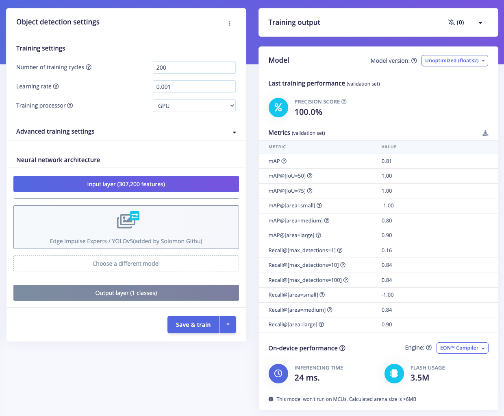

### Problem Statement:

Traditional on-street parking enforcement, which relies on static signage, time-limited meters, and periodic monitoring by human attendants, is prone to inefficiencies, non-compliance, and enforcement gaps. These limitations often result in parking misuse, particularly in areas with time-restricted or paid zones, undermining both urban regulation and revenue. In the context of smart cities, there is a need for automated, intelligent systems that can monitor parking behavior in real time.

### Solution:

To address this challenge and as part of a learning process in deploying vision-based Edge AI, we developed this project powered by a YOLO-based object detection model. The model is trained and optimized using Edge Impulse Studio, then deployed on a Raspberry Pi 5 for real-time inference. Leveraging transfer learning and pre-trained weights from YOLO, we significantly reduced the amount of data required for model training while maintaining high accuracy for our targeted use case. This system integrates seamlessly with Python-based tracking logic, enabling enforcement of zone-specific parking rules (e.g., no-parking zones, paid durations, violation thresholds) with visual feedback and temporal tracking. The result is a low-cost, energy-efficient, and scalable solution suitable for modern urban parking management — a Smart Parking Meter.

#### Hardware Component:

- Raspberry Pi 5
- Keyboard, mouse or PC/laptop via ssh
- USB Camera/webcam (eg. Logitech C920)
- LCD/monitor
- Mini tripod
- Car miniatures with Street Parking setup

#### Software & Online Services:

- EdgeImpulse Studio
- EdgeImpulse’s Linux & Python SDK
- Raspberry Pi OS
- Open CV

### Steps:

#### 1. Collecting Data

In the initial stage of building a model in Edge Impulse Studio, we need to prepare the data. You can collect your own data to better suit the purposes of your project; in this case we capture from smartphone/camera and save them in a folder. For those who are not familiar with Edge Impulse Studio, please follow these steps —> Open studio.edgeimpulse.com, login or create an account then create a new project. Choose Images project option, then Object detection. In Dashboard > Project Info, choose Bounding Boxes for labeling method and Raspberry Pi for target device. Then in Data acquisition, click on Upload Data tab. Choose you saved folder then upload.

#### 2. Labeling

The next step is labeling, now click on Data Acquisition, click on Labeling queue tab, then start drag a box around an object and label it and Save. Repeat.. until all images labelled. Alternatively you can try Edge Impulse new feature: AI auto labeling.

After labeling, it’s recommended to split the data into training and testing sets, around an 80/20 ratio. If you haven't done this yet, click on Train / Test Split to automate this process.

#### 3. Train and build model

Once your labelled dataset is ready, go to Impulse Design > Create Impulse, and set the image width and height to 320x320. Choose Fit shortest axis, then select Image and Object Detection as the learning blocks, and click Save Impulse. Next, navigate to the Image Parameters section, select RGB as the color depth, and press Save parameters. After that, click on Generate, where you’ll be able to see a graphical distribution.
Now, move to the Object Detection section and configure the training settings. Select GPU processor and set the training cycles to around 200 and learning rate to 0.001. Choose YOLOv5 as the neural network architecture — for higher resolutions (eg. 640x640), you can try YOLOv5 (Community blocks) with a model size of medium (YOLOv5m) — Once done, start training by pressing Start training, and monitor the progress.
If everything goes well and the precision result is above 80%, proceed to the next step. Go to the Model Testing section, click Classify all, and if the result is around 90%, you can move on to the final step — Deployment.

#### 4. Deploy model on Raspberry Pi

Simply ensure that the model has been built in Edge Impulse Studio. Now, you can test, download the model, and run everything directly from the Raspberry Pi.

On the Raspberry Pi side, there are several things that need to be done. Ensure you have the latest Raspberry Pi OS which supports the new Edge Impulse Linux CLI version >= 1.3.0. Then install dependencies, follow the instruction from this link: https://docs.edgeimpulse.com/docs/edge-ai-hardware/cpu/raspberry-pi-5 and you also need to install Linux Python SDK, please follow this link: https://docs.edgeimpulse.com/docs/tools/edge-impulse-for-linux/linux-python-sdk

Next, build/download/run the model via EI (Edge Impulse) runner. Open terminal on Raspberry Pi or `ssh` from your PC/laptop then simply type `edge-impulse-linux-runner` add `--clean` for allow you to select your project. Log in to your account then choose your project. This process will download the model.eim, which is specifically built for aarch64 architecture (Pi 5 ARM64). During the process, the console will display the path where the `model.eim` has been downloaded. For example, in the image below, it shows the file located at `/home/pi/.ei-linux-runner/models/624749/v5`
Once this model.eim downloaded, you can cancel inference process by type ctrl C.
For convenience, you can use the following command to copy it to the home directory for easier access: `cp -v model.eim /home/pi`

Now the model is ready to run in a high-level language such as the Python program. To ensure this model works, we can re-run the EI Runner with the camera setup on the Raspberry Pi. You can see via your browser (local IP address provided when EI Runner is run). Run this command: `edge-impulse-linux-runner`

The inferencing time is around 40ms, which is an incredibly fast for object detection speed.

#### 5. Build a Visitor Heatmap Program (Python)

With the impressive accuracy of live inferencing using EI Runner, we can now create a Python-based Parking Meter program. This code performs object tracking and parking duration analysis using bounding boxes detected by our YOLOv5 based model. For every frame, it identifies the location and size of detected cars, then attempts to match them with previously tracked objects using Intersection over Union (IoU), distance between centers, and size similarity. If a match is found, it checks whether the object has moved; if not, it updates the tracked object's "stopped" duration. If the object has moved or reappeared after more than 3 seconds, it resets the timer. The system only starts displaying bounding boxes if a car has remained stationary for 5 seconds or more, ensuring it is actually parked.
Each car is also assigned to one of four parking zones (A, B, C, or D) based on its location. Zone A and B allow parking but turn the bounding box red if the duration exceeds 30 or 100 seconds. Zone C is a no-parking zone and triggers a red box after just 5 seconds. Zone D is a paid parking area where the display shows a dollar amount instead of time, charging $5 every 10 seconds. This zone-based logic allows for flexible rules depending on where the car is parked, and visual feedback is given via color-coded bounding boxes and overlaid text.

For all codes, images and videos can be accessed from this repository.

For USB camera connected to the Raspberry Pi, run the program (parkingmeter1.py) with the following command:
`python3 parkingmeter1.py <path to modelfile>/model.eim`

To run the program (parkingmeter2) using a video file as input (e.g., video.mp4), we can add the path to the video file when executing the program:
`python3 parkingmeter2.py <path to modelfile>/model.eim <path to videofile>/video.mp4`

Note:
For video/camera capture display, you cannot use the headless method from a PC/laptop. Instead, connect a monitor directly to the Raspberry Pi to view the visuals.

Check our demo video: 

https://youtu.be/xL7PMEsPSeU

### Conclusion:

We have successfully implemented a YOLOv5-trained ML model into our Python-based visual parking meter system. Despite using a minimal dataset for training, the model achieved reliable accuracy in our use case. The integration of object detection and tracking allows the system to recognize parked vehicles, monitor their duration, and maintain consistent tracking even in challenging conditions like short disappearances or slight changes in bounding box size.
The system also supports multiple parking zones, each with its own enforcement rules, such as no-parking alerts, time-based violations, and dynamic fee calculation. This level of flexibility demonstrates the system’s ability to adapt to real-world constraints while keeping resource usage low. With its real-time performance, simple setup, and cost-effective, the project has successfully met our objectives. The result is a scalable, that is well-suited for broader deployment in smart city infrastructure.
